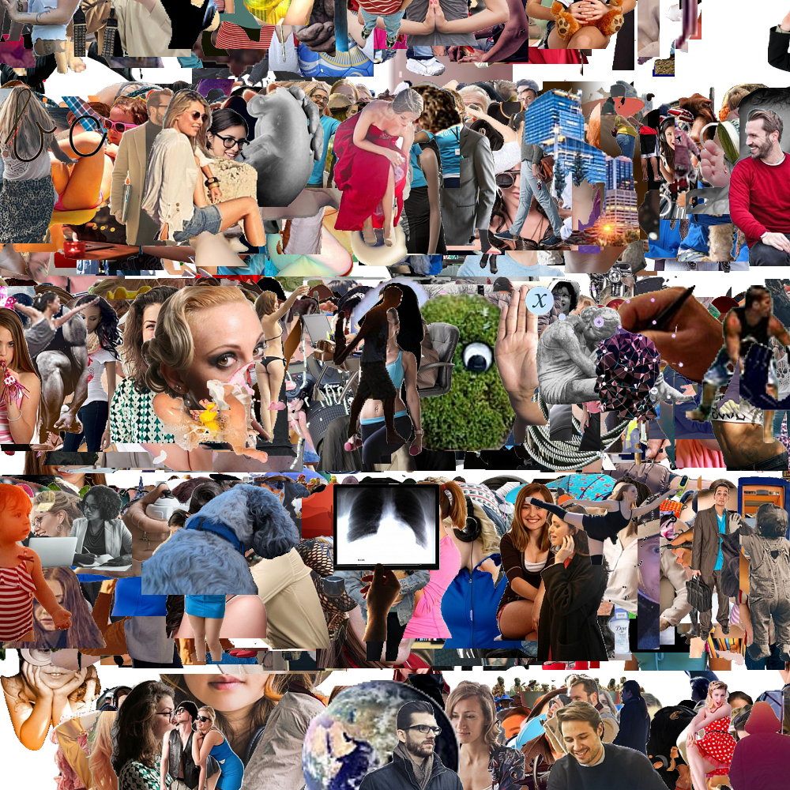
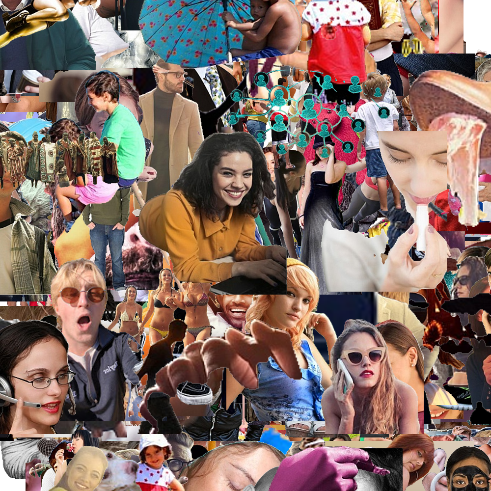
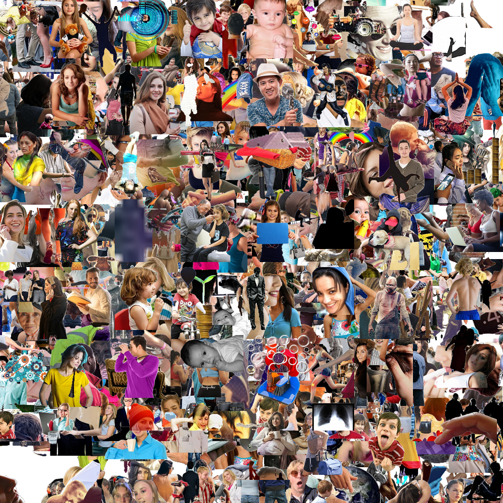

# Automatic Collage Maker

## Description

Provide a short description explaining the what, why, and how of your project. Use the following questions as a guide:

I made this application because I love making collages. This program makes the process of making a collage completely automated. By using a credential.json file that you get from the Google Cloud Console, you can give the program access to your google information and it will pull photos automatically from your account. All you have to do is specify the filters you want to use in and run main.py.

## Usage
To use this program you first need to add your credentials.json file to a folder named \_secret_ in your cloned copy of the repo. For security reasons, this folder has been included in the .gitignore file so don't worry about accidentally commiting your google account information.

Then once you have that set up you can set the filters and other paramters that you want to use in the main.py file and then run it. Then your collage should be saved to test.png.

## Example 

